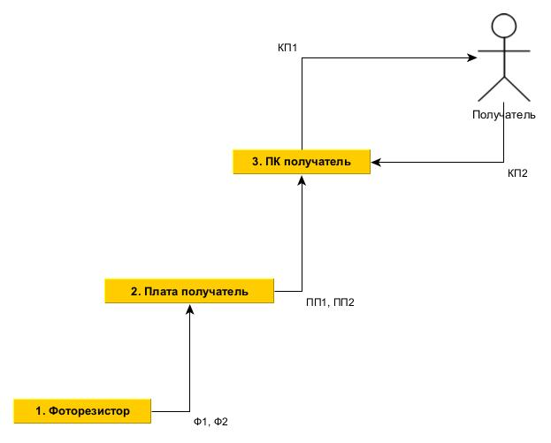
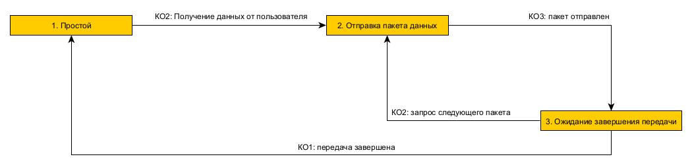
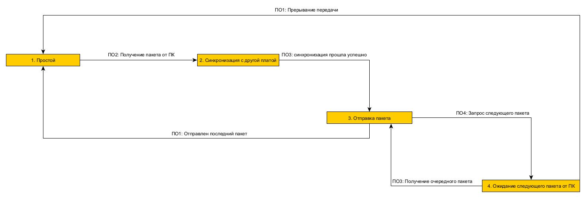
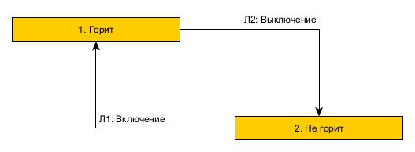
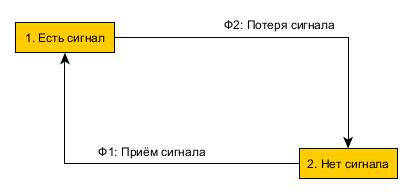
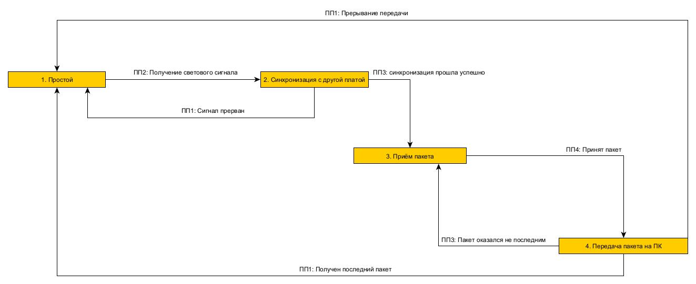
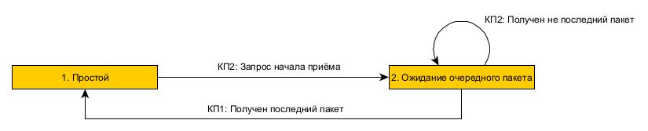
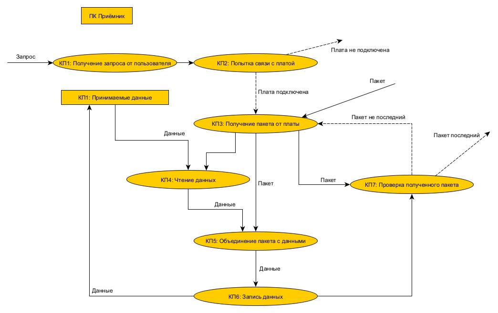
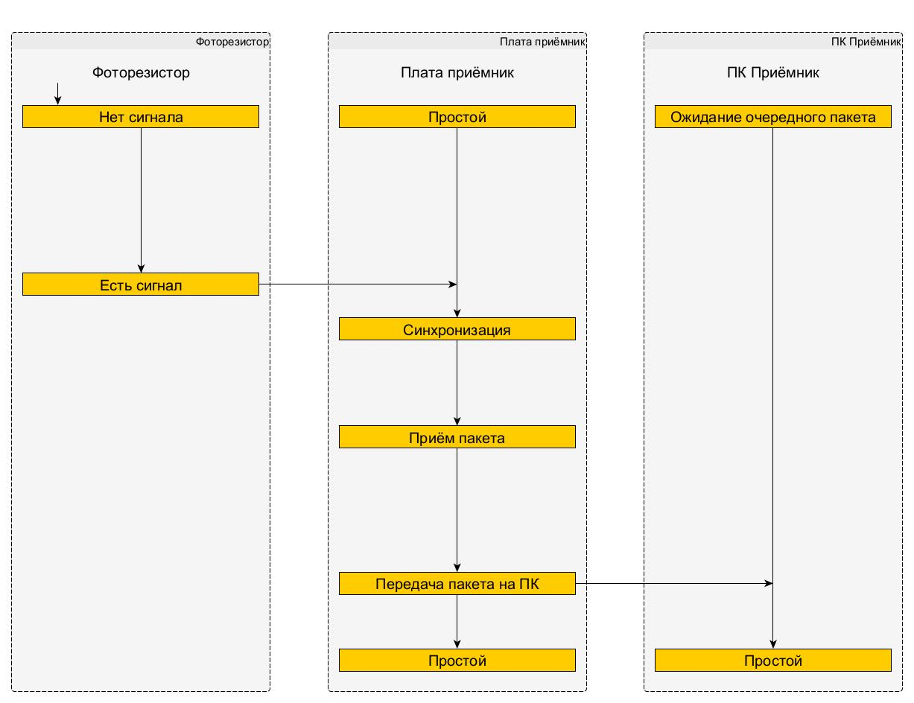

## Информационная модель

## Модель взаимодействия объектов

## Диаграммы переходов состояний

### ПК отправитель

### Плата отправитель

### Лампочка

### Фоторезистор

### Плата приёмник

### ПК приёмник

## ДПДД

## Канал управления

